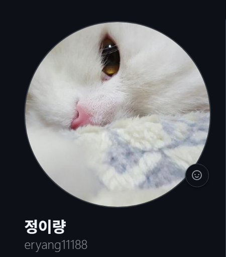
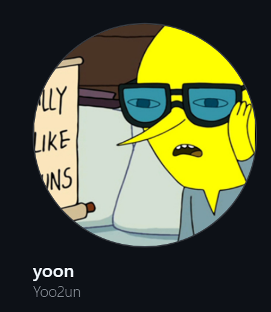
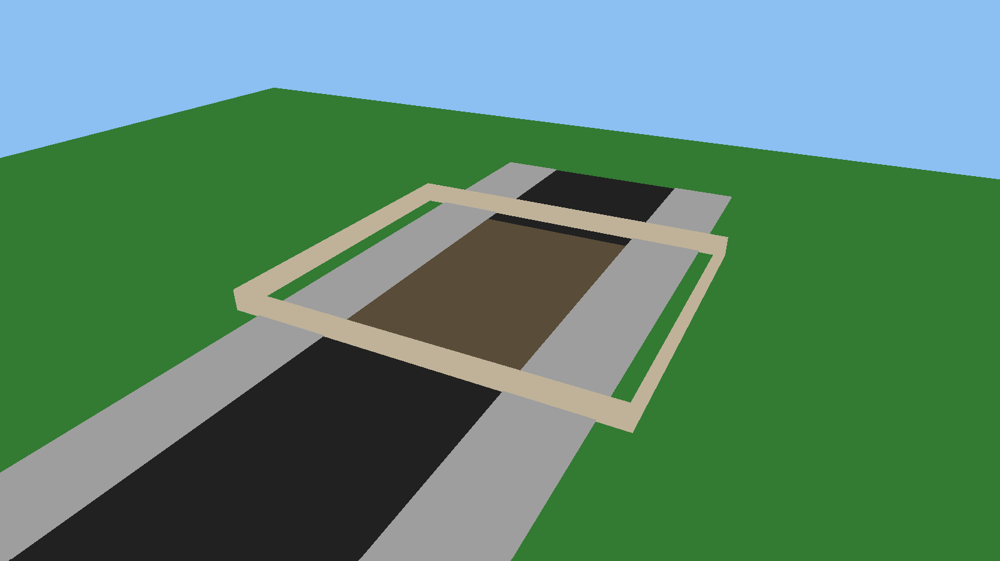
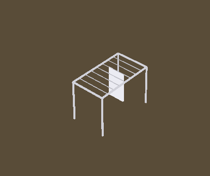
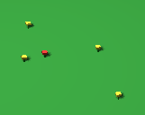

# 컴퓨터그래픽스 과제 : 3D주택 구현
> **1조 컴퓨터그래픽스 과제 보고서입니다.**

[Github 원격 저장소 바로가기](https://github.com/eryang11188/Computer-Graphics_project_Team1.git)

##  목차
- [I. 서론](#i-서론)
  - [팀 소개](#팀-소개)
  - [과제 개요](#1-과제-개요)
  - [요구사항](#2-요구사항)
  - [제출 목록](#3-제출-목록)
  - [과제 요구 조건 체크리스트](#4-과제-요구-조건-체크리스트)
- [II. 본론](#ii-본론)
  - [미리보기 - 짱구 집](#미리보기---짱구-집)
  - [개발 환경 및 실행 방법](#1-개발-환경-및-실행-방법)
  - [GitHub 사용 전략 & 조원 별 구현 역할](#2-github-사용-전략--조원-별-구현-역할)
  - [구현 & 그래픽스적 개념](#3-구현--그래픽스적-개념)
  - [문제 발생 & 해결 과정](#4-문제-발생--해결-과정)
  - [회의록](#5-회의록)
  - [Pull Request 기록](#6-pull-request-기록)
- [III. 결론](#iii-결론)
  - [배운 점](#1-배운-점)
  - [느낀 점](#2-느낀-점)
  - [아쉬운 점](#3-아쉬운-점)
- [부록](#부록)


# I. 서론

### 팀 소개
| <a href="https://github.com/eryang11188" target="_blank"></a> | <a href="https://github.com/Yoo2un" target="_blank"></a> | <a href="mailto:taewon493@gmail.com"></a> | <a href="mailto:hotppiinnkk1111@gmail.com" ></a> |
|:---:|:---:|:---:|:---:|
| **정이량** | **이윤정** | **강태원** | **정원제** |
| 20222017 | 20243120 | 20243084 | 20222016 |


> 조장: 정이량

---

### 1. 과제 개요
> **본 과제는 3D 주택을 OpenGL을 이용해 구현하는 과제입니다.**

> 저희는 3D주택을 애니매이션 **_'짱구는 못말려'_** 의 주인공 짱구의 집으로 선정했습니다.

---

### 2. 요구사항:
 - **과제명:** 3D 주택 디자인 하기
 - **세부 사항:** 
    - `C` 언어와 OpenGL만 사용 (필요한 수학 라이브러리는 사용 가능), 외부 3D 툴 사용 금지
   - 주택 내부(실내 구조, 방, 가구 등)는 구현하지 않아도 됨
   - 저택 건물 본체 1개 이상 구현
   - 지붕 형태 구현 (사다리꼴, 육면체 형태 모두 관계 없음)
   - 마당/정원/진입로 구현
   - 담장/펜스, 나무/가로등/벤치 등 최소 2종 이상의 외부 오브젝트 배치
> _[@e캠퍼스 공지사항](https://ecampus.changwon.ac.kr/mod/ubboard/article.php?id=363840&bwid=162629)_
---

### 3. 제출 목록:
- **소스코드 일체**  `main.cpp`-_( e캠퍼스 첨부 )_
- **보고서**- `README.md`_( e캠퍼스 첨부 )_
- **팀원 별 역할분담: 구현 파트 명시**- _( 본 보고서 및 Github )_
- **회의록** _( 본론에서 후술)_
- **각 기능에 사용된 그래픽스 적 개념**- _( 본론에서 설명 )_
- **참고 문헌 URL, 논문 등** -_( 결론에서 설명)_
> _[@e캠퍼스 공지사항](https://ecampus.changwon.ac.kr/mod/ubboard/article.php?id=363840&bwid=162629)_
---

### 4. 과제 요구 조건 체크리스트: 

| 구분 | 구현 여부 | 설명 |비고|
|:------|:---:|:------:|:-----:|
| 주택 본체 | O | 1개 이상 구현 |과제 요구사항|
| 지붕 구조 | O | 사다리꼴 + 사각형 도형 |과제 요구사항|
| 주택 내부 | X | **과제 조건에 따라 제외** |--|
| 마당 / 진입로 | O | 주택부지 / 주택 입구 |과제 요구사항|
| 담장  | O | 외부 오브젝트 |과제 요구사항|
| 나무/가로등 | O | 외부 오브젝트: 최소 2종 이상  |과제 요구사항|
| 자동차 | O | 외부 오브젝트  |추가 구현|
| 구름 | O | 외부 오브젝트 |추가 구현|
| 꽃 | O | 외부 오브젝트 |추가 구현|
> _요구사항 체크리스트_
---

# II. 본론

## 미리보기 - 짱구 집

### 정면 / 위
|  |  |
|:--:|:--:|
| **▲ 정면** | **▲ 위** |

### 좌측 / 우측
|  |  |
|:--:|:--:|
| **▲ 좌측** | **▲ 우측** |

### 최종 결과
|  |
|:--:|
| **▲ 최종** |

---

**_유의사항:_**
> **카메라 시점(피봇) 기준은 항상 짱구집입니다.**

> **실행 시 구름 위치가 랜덤으로 생성되므로 가끔 카메라가 구름 안에 있을 때가 있습니다.**

---


## 1. 개발 환경 및 실행 방법
### 1.1. 개발 환경
 
- **본 프로젝트는 다음과 같은 개발 환경에서 진행**
    - 사용 언어: `C++`
    - API: OpenGL (GLFW, GLAD)
    - 개발 도구: Visual Studio 2022, Visual Studio, Git
     > 코드 편집이나 수정은 `Visual Studio`에서 진행하고, 실행 확인은 `Visual Studio 2022`에서 했습니다. _(저희 세팅이 `Visual Studio 2022`를 기준으로 되어 있기 때문입니다)_
    - 실행 환경: Windows
    - 관리: GitHub

---

### 1.2. 실행 방법

**1. Visual Studio 2022 를 glad, GLFW, glm의 경로를 인식할 수 있게 세팅**
> cmake 등은 세팅되어 있다고 가정
 
**2. `main.cpp`와 ,`TransformUtils.h`, `WorldConfig.h`를 같은 폴더에 나둔다**

**3. Visual Studio 2022에 `main.cpp`를 넣고 빌드 후 실행**


**빌드 및 실행:**


---
### 1.3. 조작법
- **카메라 앵글 회전:** (W A S D)
- **줌 인/아웃:** (마우스 휠 +/-)
---

## 2. GitHub 사용 전략 & 조원 별 구현 역할
### 2.1. 브랜치 전략 
**Github 기반 협업으로 다음과 같이 진행**

1. 각 기능 / 구현 별로 브랜치 생성
2. `Pull Request` 중심으로 코드 병합 후 리뷰 진행
3. 충돌 발생 시 코드 분석 및 수정 후 통합
>이 과정에서 전체적인 개발 흐름을 파악하고 코드 추적이 용이하도록 브랜치 관리를 철저히 하였습니다. 
> 또한 PR 생성 및 주기적인 커밋을 통해 협업을 효율적으로 진행하였습니다.


---


### 2.2. 프로젝트 구조 & 실행 흐름

- 디렉토리 구조:
    ```   
    /Computer-Graphics_project_Team1
    │
    ├─ /include
    │  ├─ TransformUtils.h
    │  └─ WorldConfig.h
    │
    ├─ /src
    │  ├─ glad.c
    │  └─ main.cpp
    │
    ├─ /screenshots
    │  ├─ 1.png
    │  └─ 2.png
    │      ...
    │
    └─ README.md
    ```
    
---
  **설명:**
- `main.cpp` : 프로그램의 진입점. 윈도우 생성, 입력 콜백 처리, 쉐이더 컴파일, 그리고 **메인 렌더링 루프**를 담당.

---

- `TransformUtils.h` : **객체의 이동/회전/크기 변환**에 도움을 주는 함수 모음


- `WorldConfig.h` : **윈도우 크기, 카메라 설정 값, 집/마당/울타리의 규격 및 색상** 등 **전역 상수**를 관리하여 유지보수를 용이하게함
    - 협업을 통해 작업하다보니까, 누가 수정한 코드를 이어받거나 PR할 때, 위에서 말한 값들을 통일하지 않으면 굉장히 번거로운 일들이 일어나기 때문 
        
        >실제로 이 과정을 겪으면서, 해더파일을 선언 후에 다시 재작업을 하기로 토의 후, 원점으로 돌아가 검토함
        > _참고: [PR #1](https://github.com/eryang11188/Computer-Graphics_project_Team1/pull/1)_

> 위의 두 해더 파일 덕분에, 본 프로젝트에서는 Y축을 상방, X축을 좌우, Z축을 전후 방향으로
**모든 객체는 동일한 월드 좌표계를 기준으로 배치되어** 주택 중심을 기준 피봇으로 삼아 계층적으로 모델링이 가능해짐.

---

- 큐브 재사용 구조 : 별도의 외부 모델 또는 텍스쳐(.obj, .jpg) 파일 없이, **단 하나의 큐브 정점 데이터(VAO)**를 사용하여, Model Matrix만 변경하는 방식으로 많은 객체들을 그려내는 모델링 방식을 사용했습니다.


- Rendering 흐름 : struct RenderItem { mat4 model; vec3 color; } 구조체를 정의하고, std::vector에 렌더링할 모든 객체의 정보를 담은 뒤, 렌더링 루프에서 이를 순회하며 그립니다.


- 프레임 단위 렌더링 순서 : 
    1. Shadow Pass: 광원의 시점에서 장면을 렌더링하여 깊이 맵(Depth Map) 생성
    2. 초기화: 뷰포트 복구 및 컬러/깊이 버퍼 초기화
    3. 장면 패스: 카메라 시점에서 장면 렌더링 

--- 

## 3. 구현 & 그래픽스적 개념

### 3.1. 조원 별 구현(과제 요구사항) 역할

| 이름 | 역할 | 설명 |방법|
|:------|:---:|:------:|:-----:|
| 정이량 | 주택 구조(1층/2층/차고), 가로등|집 본체 및 부속 건물 구현 |계층적 모델링 및 삼각함수를 이용한 지붕 경사 계산|
| 이윤정 | 자연환경(구름, 잔디), 담장  |구름/잔디 배치, 울타리 |구름은 rand()함수를 통해 매번 실행 될 때 마다 무작위 위치에서 생성|
| 강태원 | 외부 오브젝트(건조대, 나무) |  |기본 큐브의 스케일 변형(Scaling) 및 반복 배치|
| 정원제 | 추가 구현: 외부 오브젝트(자동차) |  |부품별(바퀴, 차체, 창문) 상대 좌표 계산 및 조립|

**코드 예시:**
- **주택 구조:**
    ```c++
    // 1층 생성 
    float f1Y = slabY + slabH;
    AddBox(glm::vec3(Hc.x, f1Y, Hc.z), ..., glm::vec3(W1, H1, D1), colWall, true);

    // 1층 지붕 생성 & 높이 반환 (2층 배치를 위한 기준 확보)
    float midRoofTopY = AddDeckSkirtRoof(..., midEaveY, ...);

    // 반환된 지붕 높이를 기준으로 2층 배치 
    float f2Y = midRoofTopY + supportThk;
    AddBox(glm::vec3(roof2Center.x, f2Y, roof2Center.z), ..., glm::vec3(W2, H2, D2), colWall, true);
    ```


- **차고:**
    ```c++
    // 차고 기둥 배치 (차체 중심 기준 상대 좌표)
    float colX = carFootW * 0.5f - 0.95f * HOUSE_SCALE;
    float colZ = carFootD * 0.5f - 1.05f * HOUSE_SCALE;
    AddBox(glm::vec3(carCenter.x - colX, carBaseY, carCenter.z + colZ), ..., colWood, true);

    // 차고 지붕 생성 - X축 방향 처마
    AddGableRoof_EaveX(glm::vec3(carCenter.x, 0.0f, carCenter.z),
        carFootW, carFootD, carEaveY,
        carPitch, carRoofThk, carOver, colRoof, colRoof * 0.92f);
    ```    
   

---

- **담장:**
    ```c++
    // 담장 생성 함수 (벽체 + 상단 덮개 + 생울타리)
    auto AddWallX = [&](float cx, float cz, float len, bool addHedge) {
        // 벽체
        AddBottom(glm::vec3(cx, overlayY, cz), ..., glm::vec3(len, fenceH, fenceThk), wallColor);
        // 상단 덮개
        AddBottom(glm::vec3(cx, overlayY + fenceH, cz), ..., glm::vec3(len, capHh2, capThk2), capColor);
    };

    // 집 주변을 감싸는 담장 배치
    AddWallX(center.x, center.z - fenceHalfL, fenceLenX, true); // 뒷면
    AddWallZ(center.x - fenceHalfW, center.z, fenceLenZ, true); // 좌측면
    ```
   

---

- **나무:**
    ```c++
    // 나무: 위로 갈수록 작아지는 큐브를 적용하여 원뿔 형태 모방
    auto AddPine = [&](glm::vec3 base, ...) {
        AddBottom(base, ..., trunkColor); // 나무 기둥
        AddBottom(base + y1, ..., leafColor); // 잎 (하단)
        AddBottom(base + y2, ..., leafColor * 0.95f); // 잎 (중간)
    };
    ``` 
   

---

### 3.2 각 기능에 사용된 그래픽스적 개념
| 기능 | 종류 |그래픽스 개념 |
|------|------------------|------------|
|카메라 이동  |카메라 앵글 회전(WASD), 마우스 줌(in/out) |구면 좌표계를 직교 좌표계로 변환, LookAt 행렬|
| 모델링 | 계층적 모델링|짱구집 기준으로 pivot(기준점)지정 후 이동 / 회전 / 신축 |
| 렌더링 | 그림자 추가, 명암 적용, 재질 입히기|섀도우 매핑, 퐁 셰이딩 기법(조명)|


**코드 예시:**
- **카메라 이동**:
    ```c++
    // 구면 좌표를 직교 좌표계로 변환하여 카메라 위치 계산
    float cp = std::cos(pitch); 
    float sp = std::sin(pitch);
    float cyv = std::cos(yaw);  
    float syv = std::sin(yaw);

    // radius(거리), pitch(상하각), yaw(좌우각)를 이용해 x,y,z 도출
    cameraPos.x = center.x + radius * cp * syv;
    cameraPos.y = center.y + radius * sp;
    cameraPos.z = center.z + radius * cp * cyv;

    // 뷰 평면 생성 (시점)
    glm::mat4 view = glm::lookAt(cameraPos, center, glm::vec3(0, 1, 0));
    ```
- **모델링**:
    ```c++
    // [TransformUtils.h] 바닥면을 기준점(피봇)으로 하는 모델 변환 행렬 생성
    inline glm::mat4 MakeModel_BottomPivot(const glm::vec3& pos, ..., const glm::vec3& scale) {
        glm::mat4 M(1.0f);
        M = glm::translate(M, pos); // 1. 지정된 위치로 이동

        // 2. 피봇 보정: 큐브의 중심이 아닌 바닥면이 (0,0,0)에 오도록 Y축으로 반만큼 올림
        M = glm::translate(M, glm::vec3(0.0f, scale.y * 0.5f, 0.0f)); 

        M = glm::rotate(M, eulerRad.y, glm::vec3(0.0f, 1.0f, 0.0f)); // 3. 회전
        M = glm::scale(M, scale); // 4. 크기 조절
        return M;
    }
    ```
- **렌더링**:
    ```c++
    // [Fragment Shader] Blinn-Phong 조명 모델 및 그림자 계산 로직

    // 1. Blinn-Phong 반사광 계산 
    vec3 halfDir = normalize(lightDir + viewDir);
    float spec = pow(max(dot(norm, halfDir), 0.0), shininess);

    // 2. 그림자 계산 함수 호출
    float shadow = ShadowCalculation(FragPosLightSpace, norm, lightDir);

    // 3. 최종 색상 = (환경광 + (1.0 - 그림자) * (확산광 + 반사광)) * 물체색
    vec3 lighting = (ambient + (1.0 - shadow) * (diffuse + specular)) * uColor;
    FragColor = vec4(lighting, 1.0);
    ``` 

---

### 3.3. 추가 구현 오브젝트

**요구사항 외에 추가 모델링을 통해 새로운 오브젝트를 만들어 봤습니다**

| 기능 | 특징| 
|:------|:-------------|
| 구름 |`rand()`로 매번 시작할 때마다 다른 위치에 생성 |
| 자동차 |차체, 바퀴, 와이퍼, 번호판 등 부품을 세분화하여 조립하고 계층적 구조로 배치 |
| 건조대 |얇게 스케일링한 큐브를 연결하여 프레임을 만들고, 그 위에 수건 객체를 배치 |
| 흰둥이집 |먼저 구현한 메인 주택의 모델링 방식을 축소 적용, 입구에 검은색 큐브를 배치하여 깊이감(구멍) 표현  |
| 꽃 | 마당 영역 내 무작위 좌표 생성, 단 도로/집과 겹치지 않도록 충돌 체크 로직 적용 |
| 우편함 | 기둥, 본체, 투입구, 깃발 등 4개의 모델을 계층적으로 조립하여 구현 |

---

**코드 예시:**
- **구름:**
    ```c++
    // 구름 생성 함수 (여러 큐브를 뭉쳐서 구름 형태 표현)
    auto AddCloud = [&](glm::vec3 c, float s) {
        AddCenter(c, ..., glm::vec3(10.0f * s, 2.5f * s, 6.0f * s), cloudColor);
        AddCenter(c + glm::vec3(-4.0f * s, ...), ..., cloudColor);

    };

    // rand()를 이용해 매번 무작위 위치와 크기로 구름 생성
    for (int i = 0; i < cloudCount; ++i) {
        float rx = (float)(rand() % range - halfRange); // 랜덤 X 좌표
        float yy = cloudY + (float)(rand() % 25 - 10);  // 랜덤 높이
        float ss = 0.8f + (float)(rand() % 60) / 100.0f; // 랜덤 크기
        AddCloud(glm::vec3(xx, yy, zz), ss);
    }
    ```
   

---

- **자동차:**
    ```c++
    // 차체 배치
    AddBottom(carC, ..., glm::vec3(bodyW, bodyH, bodyL), carGreen);

    // 바퀴 배치: 차체 중심 기준 상대 좌표 계산
    auto AddWheelRing = [&](glm::vec3 wheelC, ...) { ... }; // 휠 링 생성 

    glm::vec3 wFL(carC.x - wheelX, wheelY, frontZ); // 앞바퀴 좌표 계산
    AddWheelRing(wFL, wheelR, wheelThk, tire, rim); // 바퀴 배치

    // 와이퍼, 번호판 등 디테일 부품 배치
    AddCenter(p, ..., glm::vec3(bladeL, bladeH, bladeT), wiperCol);
    ``` 
   

---

- **건조대:**
    ```c++
    // 얇은 큐브를 연결하여 다리 생성
    AddBottom(rackPos + glm::vec3(legX[ix], 0.0f, legZ[iz]), ..., glm::vec3(pThk, rH, pThk), colFrame);

    // 반복문을 이용해 일정한 간격으로 와이어 배치
    for (int i = 1; i <= wireCount; ++i) {
        float xPos = (rW * 0.5f) - (wireGap * i);
        AddCenter(rackPos + glm::vec3(xPos, topY, 0.0f), ..., colWire);
    }
    // 건조대에 널 수건 배치
    AddCenter(rackPos + glm::vec3(towelX, ...), ..., towelColor);
    ``` 
   

---

- **흰둥이집:**
    ```c++
    // 흰둥이집 몸통(박스)
    AddBox(glm::vec3(dogC.x, dogY, dogC.z), ..., glm::vec3(dogW, dogH, dogD), dogWall, true);

    // 흰둥이집 지붕 (메인 주택의 지붕 함수 재사용)
    AddGableRoof_EaveZ(glm::vec3(dogC.x, 0.0f, dogC.z), dogRoofW, dogRoofD, ..., dogPitch, ...);

    // 입구 구멍 (검은색 얇은 박스를 덧대어 깊이감 표현)
    AddBox(glm::vec3(dogC.x, dogY + dogH * 0.05f, ...), ..., holeCol, true);
    ```
   .png)

---

- **꽃:**
    ```c++
    // 마당 영역 내 랜덤 좌표 생성
    float fx = center.x + rx; float fz = center.z + rz;

    // 집이나 도로 위에는 생성되지 않도록 충돌 체크
    if (IsOverlapping(fx, fz)) continue; 

    // 줄기 생성
    AddBottom(glm::vec3(fx, overlayY, fz), ..., glm::vec3(stemW, stemH, stemW), stemCol);
    // 꽃잎 생성 (색상은 랜덤 지정)
    AddCenter(glm::vec3(fx, overlayY + stemH + 0.10f, fz), ..., petalCol);
    ```
  

---


- **우편함:** 
    ```c++
    // 우체통 기둥 배치
    AddBottom(glm::vec3(mbX, mbY, mbZ), ..., postCol);

    // 우체통 본체 박스 (빨간색)
    AddBottom(glm::vec3(mbX, boxY, mbZ), ..., glm::vec3(..., 0.52f * MB_SCALE, ...), boxCol);

    // 투입구와 깃발 추가
    AddCenter(..., slotCol); // 검은색 투입구
    AddCenter(..., flagCol); // 빨간색 깃발
    ```
       

---


## 4. 문제 발생 & 해결 과정  
### 문제 요약 테이블

|문제 |설명 |비고|
|:--------|------|--------------|
|2층 지붕| 집 지붕이 뾰족하게 튀어나옴 | 모델링 |
| 2층 지붕|위쪽 시점에서 집 지붕을 보면 지붕 중앙이 비어있음 | 모델링|
|2층 지붕 - 블록 사이|좌/우 시점에서 2층을 보면 지붕과 2층 사이가 비어있음 | 모델링|
|1층 블록 - 2층 블록 사이| 1층과 2층 중첩 시 부자연스러움 |  모델링|
|재질 적용 |그림자 / 명암 / 밝기 등 재질이 제대로 적용이 안됨|  렌더링 |

---

### 문제 1. 집 지붕이 뾰족하게 튀어나옴
- **스크린샷:**
  .png)

- 원인: 지붕 패널(Cube)을 회전(Rotate)시킬 때, 회전축이 큐브의 정중앙에 위치해 있어 두께만큼 위치가 어긋나거나 처마 끝이 의도치 않게 튀어나오는 현상이 발생함.

- 해결: 삼각함수를 사용하여 지붕의 경사각(pitch)에 따른 정확한 Y축(높이), Z축(너비) 이동 거리를 계산하여 배치함.


    - 수정 전 코드: 
      ```c++
        glm::translate(pos + glm::vec3(0.0f, 0.5f, 0.0f)); // 눈대중으로 위치 맞춤
      ```
    - 수정 후 코드: 
      ```c++
        // 경사각에 따라 높이를 정확히 계산
        float ridgeRise = halfSpan * std::sin(pitchRad);
        float ridgeY = eaveY + ridgeRise;
        // 계산된 위치로 정밀 이동
      ```
---

### 문제 2. 위쪽 시점에서 집 지붕을 보면 지붕 중앙이 비어있음
- **스크린샷:**
  .png)

- 원인: 사각형 큐브 두 개를 경사지게 맞붙이다 보니, 두께 때문에 꼭대기(용마루) 부분에 V자 형태의 틈이 생겨 집 내부가 보임.

- 해결: 지붕 패널 위에 얇고 긴 '덮개(Cap)' 블록을 추가로 렌더링하여 틈새를 자연스럽게 덮음.
.png)

    - 코드: 
      ```c++
        // AddGableRoof_EaveZ 함수 내부
        // 틈새를 덮을 캡(Cap)의 크기 계산
        float capW = slabW * 1.06f;
        float capH = thk * 1.05f;
        
        // 지붕 꼭대기(ridgeY) 위치에 캡 모델 추가
        glm::mat4 cap =
            T(centerXZ.x, ridgeY + capH * 0.5f, centerXZ.z) * S(capW, capH, capD);
            items.push_back({ cap, ridgeCol });
      ```
   
---

### 문제 3. 좌/우 시점에서 2층을 보면 지붕과 2층 사이가 비어있음
- **스크린샷:**
  

- 원인: 삼각형 모양지붕은 옆면이 삼각형 형태여야 하는데, 직육면체로는 빗면 아래의 삼각형 공간을 한 번에 채울 수 없어 구멍이 뚫려 보임

- 해결: `AddGableSideFill` 함수를 구현하여, 얇은 직육면체를 아래에서부터 위로 좁아지게 계단식으로 쌓아 삼각형 형태처럼 보이게함.


    - 코드: 
      ```c++
        auto AddGableSideFill = [&](float endX, float eaveY, float ridgeY, float depth) {
            int steps = 6; // 6단계로 나누어 빈 공간을 채움
            float stepH = (ridgeY - eaveY) / steps;

            for (int i = 0; i < steps; ++i) {
                float t = (float)i / steps;
                float d = depth * (1.0f - t); // 위로 갈수록 깊이를 줄여 삼각형 모양 형성
                AddBox(glm::vec3(endX, eaveY + stepH * i, z), ..., glm::vec3(thk, stepH, d), ...);
            }
        };
      ```

---

### 문제 4. 1층과 2층 중첩 시 부자연스러움
- **스크린샷:**
  

- 원인: 1층 지붕 위에 2층 방을 올릴 때, 1층의 높이와 지붕 두께 등을 일일이 하드코딩된 숫자로 더하다 보니 좌표 계산 실수로 건물이 공중에 뜨거나 파묻힘.

- 해결: 1층 지붕을 만드는 함수가 자신의 최종 높이(Y값)를 반환하도록 구조를 변경하여, 2층이 그 높이를 받아 바로 위에 생성되도록 연결함.


    - 코드: 
      ```c++
        // 1층 지붕 함수가 끝날 때 최종 높이(Top Y)를 리턴
        float midRoofTopY = AddDeckSkirtRoof(..., colRoof, ...);

        // 리턴받은 높이(midRoofTopY)를 2층 바닥(f2Y)의 시작점으로 바로 사용
        float f2Y = midRoofTopY + supportThk;
        AddBox(glm::vec3(x, f2Y, z), ..., glm::vec3(W2, H2, D2), colWall, true);
      ```
      
---
      
### 문제 5. 그림자 / 명암 / 밝기 등 재질이 제대로 적용이 안됨
- **스크린샷:**
  

- 원인: 초기에는 단색(Flat Color)이라 입체감이 없었고, 쉐도우 매핑 적용 시 해상도 한계로 물체 표면에 줄무늬 노이즈(Shadow Acne)가 발생함.

- 해결: 
    1. 조명: 입체감을 위해 블린-퐁 모델 적용.
    2. 그림자: ShadowCalculation 함수에서 빛의 각도에 따른 값을 적용하고, 주변 픽셀 샘플링 기법을 사용.
    


    - 코드: 
      ```c++
        // 빛의 입사각에 따라 bias를 유동적으로 계산하여 노이즈 제거
        float bias = max(0.005 * (1.0 - dot(normal, lightDir)), 0.001);

        // PCF: 주변 픽셀을 평균내어 부드러운 그림자 생성
        for(int x = -1; x <= 1; ++x) {
            for(int y = -1; y <= 1; ++y) {
                float pcfDepth = texture(shadowMap, projCoords.xy + vec2(x, y) * texelSize).r; 
                shadow += currentDepth - bias > pcfDepth ? 1.0 : 0.0;        
            }    
        }
      ```

---


## 5. 회의록

**팀원 간의 협업 흐름과 주요 의사결정 사항을 기록하였습니다.**

| 회차 | 날짜 | 시간 | 참석자 | 주요 안건 및 결정 사항 | 비고 |
|:---:|:---:|:---:|:---:|:---:|:---:|
| **1차** | 12/01(월) | 16:00~17:00 | 전원 | 3D 주택 주제 선정 토의 | 주제 선정 |
| **2차** | 12/07(일) | 18:00~18:30 | 전원 |선정된 주제에 대한 역할을 의논  | 역할 분담|
| **3차** | 12/18(목) | 19:00~21:30 | 전원 | 브랜치 전략 및 GitHub 규칙 통일 |  개발 규칙 |
| **4차** | 12/19(금)~ | --| 전원 | GitHub 협업을 통해 개발 | 구현 |
| **5차** | ~12/21(일) | -- | 전원 | GitHub 협업을 통해 개발 | 구현 |
| **6차** | 12/21| -- | 전원 | 버그 여부, 디버깅, 추가구현 사항 논의 | 검토  |
| **7차** | 12/21 | --| 전원 |최종 코드 확정 | 제출 |

---
### 회의록 상세 설명

**위 회의록에 기재된 주요 이슈와 해결 과정에 대한 상세 내용은 다음과 같음.**

---

####  **1차 회의 (3D 주택 주제 선정 토의)**
 - 프로젝트 명 : 3D 주택 구현 (컴퓨터 그래픽스)
 - 회의 장소 : Discord , 카카오톡
 - [안건 1] 구현할 주택 결정 논의 
 - [안건 2] 주택 외 외부 오브젝트 논의
 - [결정 사항] 프로젝트 주제 : 짱구 집 구현 및 외부객체 구현
     
  ---   
     
####   **2차 회의 (짱구집 구현에 관한 역할 의논 및 분담)**
- 구현 할 객체 : 짱구집, 차고, 차, 나무, 구름, 꽃, 가로등, 흰둥이 집, 건조대, 담장, 마당
- 객체 외 구현 : 객체 명암 부여하기, 객체 색 부여하기, 객체의 통일된 좌표계 설정
- 역할 분담 정이량 (팀장) -> 짱구집, 차고, 가로등, 꽃, 흰둥이 집
    - 정원제 -> 차
    - 강태원 -> 건조대, 나무
    - 이윤정 -> 구름, 담장
                   
---                 

###  **3차 회의 (브랜치 전략 및 GitHub 규칙 통일)**
    
 1. 브랜치 전략: 스크린샷은 `screenshots_` 라는 별도의 브랜치를 만들어서 해당 공간에 업로드, 최종 `main` 브랜치로 `merge` 하여 관리
 2. 커밋 메시지 / PR 규칙
 3. 충돌 해결 / 리뷰 방식

- 브랜치 전략: 각 팀원은 자신이 구현한 객체 단위로 개인 브랜치를 생성하여 개발
                     기능 구현이 완료되면 Pull Request를 통해 main 브랜치에 병합
- PR 생성 조건: 하나의 PR에는 하나의 기능 또는 객체 구현만 포함 PR 생성 시 구현 내용에 대한 간단한 설명을 작성
- 커밋 규칙: 커밋 메시지는 간결하고 명확하게 작성(불필요한 문장형 표현 지양)
 스크린샷은 `/screenshots` 디렉토리에 저장
                    
 ---

###  **4차 회의 (GitHub 협업 1차)**
- 각 파트 진행 상황 :
    - 정이량: 짱구집 외형 및 차고 기본 구조 구현
    - 정원제: 차량 기본 모델 구현
    - 강태원: 나무, 건조대 기본 배치
    - 이윤정: 구름 초기 구현, 담장 기본 구조 배치
- 발생한 이슈 : 객체 간 좌표계 불일치로 인한 위치 어긋남
- 충돌 해결 : 모든 객체는 공통 기준 좌표계를 사용하도록 통일
   - 2차 구현까지의 목표 :각자 맡은 객체의 기본 구조를 완성하고,
                        특히 환경 요소(구름, 잔디, 담장)가 주택 및 마당 영역과 충돌 없이 배치되도록 구현하는 것을 목표
                        
---

### **5차 회의 (GitHub 협업 2차 )**
- 각 파트 추가 진행 상황 :
    - 정이량: 짱구집 세부 구조 보완 및 위치 조정
    - 정원제: 차량 디테일 개선
    - 강태원: 나무 배치 보완 및 건조대 형태 완성 
    - 이윤정: 담장 입구 구조 구현 및 구름 생성 범위 제한
- 통합 후 테스트 결과 : 
    - 모든 객체가 하나의 월드 좌표계에서 정상적으로 렌더링됨
    - 카메라 이동 및 회전 시 시각적 오류 없음
    -  환경 요소가 주택 및 마당 영역을 침범하지 않도록 정상 동작 확인
                         
---                        
    
### **6차 회의 (버그 여부, 디버깅, 추가구현 사항 논의)**
- 객체 배치 과정에서 발생한 좌표 충돌 및 위치 어긋남 문제 디버깅
- 담장, 마당, 진입로 등 인접 오브젝트 간 겹침 현상 수정
- 흰둥이 집, 가로등, 꽃 등 추가 오브젝트 구현 결정 및 반영
    
---  
    
###   **7차 회의 (최종 코드 확정)**
- 전체 코드 최종 점검 및 수정 사항 반영
- 최종 실행 결과 확인 후 코드 확정
- 보고서 작성 분담 및 제출 일정 확인


---


### 6. Pull Request 기록

- [PR #1: 월드 좌표 규격(WorldConfig) + 모델행렬 유틸(TransformUtils) 추가](https://github.com/eryang11188/Computer-Graphics_project_Team1/pull/1)
- [PR #2: 이전 PR에서 주석 깨짐 현상 수정](https://github.com/eryang11188/Computer-Graphics_project_Team1/pull/2#issue-comment-box)
- [PR #3: 월드 바닥(땅/도로/인도) 1차 완성 + 휠 줌 추가 + 윈도우 화면 좀 더 크게 실행](https://github.com/eryang11188/Computer-Graphics_project_Team1/pull/3)
- ~~_[PR #4: 지금까지 설명 ](https://github.com/eryang11188/Computer-Graphics_project_Team1/pull/4)_~~
- [PR #5: 월드 좌표 규격 통일2 & main.cpp에서 매직 넘버 수정 ](https://github.com/eryang11188/Computer-Graphics_project_Team1/pull/5)
- [PR #6: 나무 초기 구현_강태원](https://github.com/eryang11188/Computer-Graphics_project_Team1/pull/6)
- [PR #7: 담장과 담장 입구 구현 ](https://github.com/eryang11188/Computer-Graphics_project_Team1/pull/7)
- ~~_[PR #8: 랜덤 구름 추가](https://github.com/eryang11188/Computer-Graphics_project_Team1/pull/8)_~~
- [PR #9: 잔디/구름 구현](https://github.com/eryang11188/Computer-Graphics_project_Team1/pull/9)
- [PR #10: 자동차 구현_정원제 ](https://github.com/eryang11188/Computer-Graphics_project_Team1/pull/10)

- [PR #11: 모델링 최종 완성!](https://github.com/eryang11188/Computer-Graphics_project_Team1/pull/11)

- [PR ~~#12~~ #13: 1차 렌더링 ]( https://github.com/eryang11188/Computer-Graphics_project_Team1/pull/13 )

- [PR ~~#13~~ #14: 2차 렌더링]( https://github.com/eryang11188/Computer-Graphics_project_Team1/pull/14 )

- [[프로젝트 종료] PR ~~#14~~ #15: 3차 렌더링 + 최종 코드 확정 ]( https://github.com/eryang11188/Computer-Graphics_project_Team1/pull/15 )

- [[스크린샷 정리] PR ~~#16~~ #17: 스크린샷 브랜치 main에 merge](https://github.com/eryang11188/Computer-Graphics_project_Team1/pull/17)


# III. 결론
## 1. 배운 점
- OpenGL을 이용한 3D 렌더링 과정에서 모델 변환, 시점 변환, 좌표계 개념을 실제 구현을 통해 이해할 수 있었음

- 기본 도형을 조합하여 여러 오브젝트를 구성하면서 모델링 구조 설계와 코드 재사용의 중요성을 배울 수 있었음

- GitHub 기반으로 협업을 진행하면서 브랜치 관리와 커밋 기록, 파일 버전이력 관리를 하면서 Git과 GitHub를 더 숙달

- 쉐도우 매핑 과정에서 깊이 맵과 라이트 공간 좌표의 개념을 이해
 
- 하나의 VAO를 재사용하여 여러 객체를 렌더링하는 방식의 효율성을 체감함

- 코드 구조를 먼저 설계하지 않으면 후반 작업이 급격히 어려워진다는 점을 경험함


## 2. 느낀 점

- 컴퓨터 그래픽스 흐름을 수업시간 때 이론으로만 배우다가 실제로 실습으로 체험하니까 수업 때보다 훨씬 재미있고 흥미로웠음.
    - 처음 모델링을 끝냈을 때는 너무 저 퀄리티여서 실망했는데, 렌더링을 마친 후 최종 결과물을 보니 생각보다 기대이상으로 나와서 놀랬음.


- 단순한 도형이라도 위치와 크기, 회전에 따라 결과가 크게 달라져 3D 공간 설계의 난이도가 얼마나 어려운지 깨달았음.


- 팀원들과 협업하며 구현을 진행하면서 의사소통의 중요성을 다시 한 번 느낌.
    - 각자 맡은 모델링이 서로 같은 좌표값에 나오는 경우가 종종 생겼어서, 향후에는 의사소통을 더욱 활발히 해야겠다고 느낌.

 
- 처음에 어떤 순서로 개발해야 할 지 몰라서, 모델링 하나 하고 명암을 입히는 방식으로 진행하다가 진행하다가 계속 막혔음
    - 너무 힘들어서 결국 원점으로 되돌아가 수업 때 배운 이론적인 접근인 **모델링 - 투영 - 렌더링** 단계로 진행하니까 이 후 작업이 훨씬 수월해짐. 수업 때 배운 게 실제로 쓰여서 신기했음
---

- Pivot(기준점) 설정이 모델링의 난이도를 결정하는 핵심임을 깨달음. (회전축을 바닥으로 두느냐 중심으로 두느냐의 차이)
    - 그래야 이후에 객체들이 해당 피벗을 중심으로 좌표값을 계산해서 후에 수정을 하거나 새로운 객체를 생성할 때 서로 간 충돌을 방지한다는 것을 깨달음. 

    - **기준점 선정 스크린샷(여기에 짱구집):** %20적용.gif)

---
 
- 생각보다 모델링이 엄청나게 중요한 과정임을 느낌. 
    - 초기에 구조를 잘 설계해야 나중에 객체를 렌더링 할 때 높은 퀄리티가 나옴을 몸소 체험함

- 마지막으로 주택 내부도 구현해보고 싶었으나 외부 구현도 이렇게 어렵게 하는데 내부 구현은 할 수 있을까 라는 생각이 듦.


## 3. 아쉬운 점
- 조명과 재질 표현이 제한적이어서 시각적으로 더 사실적인 렌더링을 구현하지 못한 점이 아쉬웠음 
   - 예를 들어 실제와 레이 트레이싱을 사용하여 실제 현실과 같은 해의 방향 구현을 하고 싶었는데, 난이도가 너무 높아서 가장 간단한 방식의 빛 빛 방향 계산 방식을 채택함.
 
- 컴퓨터 그래픽스 과목을 수강하면서 실습을 해봤으면 조금 더 수월하게 개발을 하였을까 라는 아쉬움이 남음

- OpenGL은 C기반 API이지만, 개발 환경은 `C++` 이라`C`에만 익숙한 나머지 `C++`만의 문법에 익숙하지 않아서 기초를 알아보는데 시간을 투자한 다소 투자함
    - 예를 들어 `C` 는 `printf`가 이렇게 동작하는데,
    ```c
    #include <stdio.h>
    int main() {
            int num = 10;
            printf("Number: %d\n", num); 
        return 0; }
    ```
    - `C++` 에서는 이렇게도 동작이 가능해서 초반에 헷갈렸음.
    ```c++
    #include <iostream>
        int main() {
            int num = 10;
            std::cout << "Number: " << num << std::endl;   
        return 0; }
    ```


## 부록

- 참고 문헌(URL)
    - [Markdown 문법](https://inpa.tistory.com/entry/MarkDown-%F0%9F%93%9A-%EB%A7%88%ED%81%AC%EB%8B%A4%EC%9A%B4-%EB%AC%B8%EB%B2%95-%F0%9F%92%AF-%EC%A0%95%EB%A6%AC) : 보고서 작성할 때 참고했습니다
    - [OpenGL 초기 세팅](https://gongdolhoon.tistory.com/entry/1-OpenGL-%EA%B0%9C%EB%B0%9C-%ED%99%98%EA%B2%BD-%EC%84%B8%ED%8C%85%ED%95%98%EA%B8%B0)
    - [3D Wharehouse](https://3dwarehouse.sketchup.com/model/ab751a20-a71c-4121-a39c-a9b04a498636/Shinnosuke-Nohara-Kasukabe-Crayon-Shin-chan-Misae-Nohara) : 짱구집 초기 모델링 할 때 참고 많이 했습니다.
    - [셰이더 사용법](https://blog.everdu.com/308)

---

### 추가 스크린샷: 

#### 1. 작업 요약 :
|   | .png)  |   |    |   |    | 
|:-------------:|:---------------:|:-----------:|:-------------:|:----------:|:-------:|
|**▲부지 선정**|**▲중반**|**▲모델링 끝**|**▲1차 렌더링**|**▲2차 렌더링**|**▲최종: 2차 렌더링 + 그림자**|

---

#### 2. 발생한 사고들

|.png)   |   .png) |   |  |   
|:-------------:|:---------------:|:-----------:|------:|
|**▲지붕 문제 1**|**▲지붕 문제 2**|**▲지붕 문제 3**|**▲렌더링 오류(실행 시 빈 화면)**|

